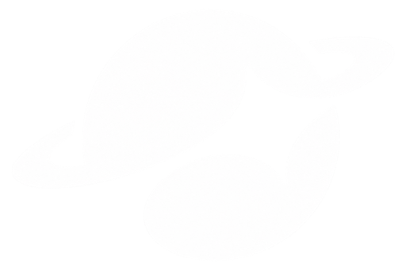
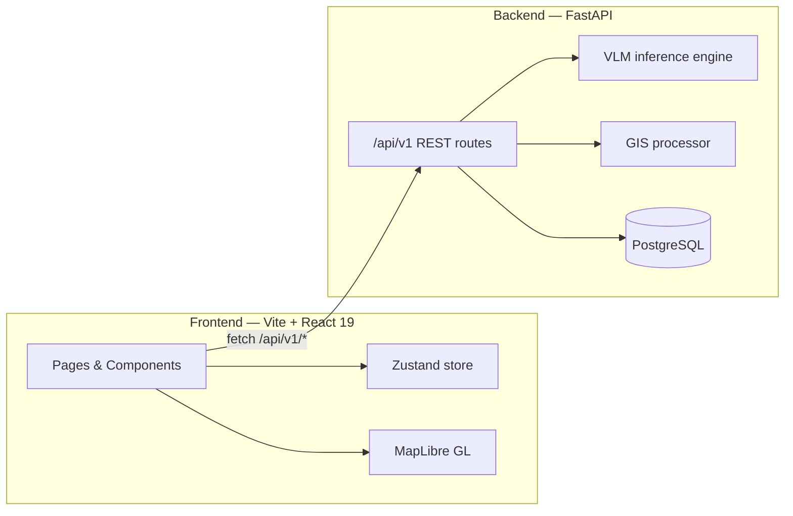
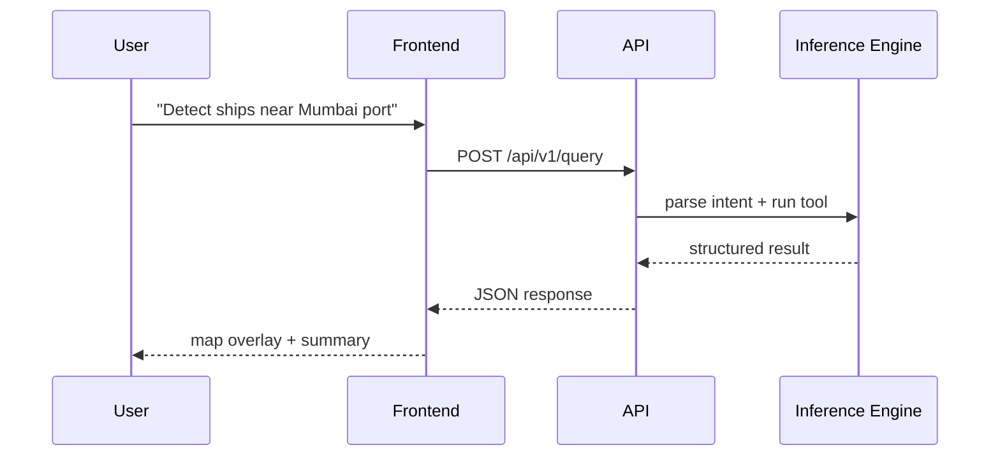

<div align="center">




<br /><br />

[](https://github.com/Vaibhav-Reddy560/SatQuery-AI)

<br />

[](https://github.com/Vaibhav-Reddy560/SatQuery-AI/actions/workflows/backend-ci.yml)
&nbsp;

&nbsp;


<br />


</div>

<br />

<div align="center">

**[Report a bug](../../issues)** &nbsp;·&nbsp; **[Request a feature](../../issues)** &nbsp;·&nbsp; **[Contents ↓](#contents)**

</div>


## Overview

**SatQuery AI** is a conversational satellite-intelligence workspace — ask a question in plain English, draw an area of interest on the map, and get object detection, change detection, land-cover classification and measurements back as structured, explainable results.

Built for **Smart India Hackathon 2026** (Problem Statement **SIH26167**), it pairs a full interactive mapping dashboard with a FastAPI backend structured around real remote-sensing benchmarks (**BigEarthNet**, **VRSBench**), ready for a trained vision-language model to be dropped in behind the same API surface.

### How it works

```text
1. ASK       →  Type a question in plain English, or pick a suggestion.
2. DRAW      →  Optionally circle an area of interest on the live map.
3. ANALYZE   →  The agent parses intent, runs the right tool, scores confidence.
4. REVIEW    →  Get back a map overlay, a data table, and a plain-English summary.
```


### Contents

[Features](#features) · [Design system](#design-system) · [Architecture](#architecture) · [Tech stack](#tech-stack) · [Getting started](#getting-started) · [Deployment](#deployment) · [Roadmap](#roadmap) · [Team](#team)

## Features

<table>
<tr>
<td width="33%" valign="top">

### 💬 Natural-language query
Ask in plain English. The agent parses intent, selects the right analysis tool, runs it, and shows its working — no dropdowns, no forms.

</td>
<td width="33%" valign="top">

### 🔍 Object detection
Buildings, vehicles, vessels, solar arrays and infrastructure, grounded to the pixel with confidence scores per feature.

</td>
<td width="33%" valign="top">

### 🔀 Bi-temporal change detection
Compare two passes over the same area and quantify exactly what appeared, vanished or shifted between them.

</td>
</tr>
<tr>
<td width="33%" valign="top">

### 🗺️ Land cover classification
Segment vegetation, water, built-up and barren classes against the CORINE taxonomy, with per-class area breakdowns.

</td>
<td width="33%" valign="top">

### 📏 Measurement
Distance, area and perimeter, drawn straight onto the imagery with sub-meter geodesic precision.

</td>
<td width="33%" valign="top">

### 🛰️ Map workspace
Pan a live satellite basemap, draw an area of interest with rectangle / polygon / circle / freehand tools, and query only what's selected.

</td>
</tr>
</table>

Everything above lives behind one consistent workspace shell:

| Section | Pages |
|---|---|
| **Workspace** | Overview dashboard · Map Explore · Conversational Query |
| **Analysis** | Object Detection · Change Detection · Land Cover · Measurements |
| **Library** | Projects · Reports |

<details>
<summary><strong>What's real vs. what's mocked, honestly</strong></summary>
<br>

The frontend, API surface, database schema and evaluation harness are fully built and wired end-to-end. The inference layer behind `/api/v1/query` currently runs a deterministic regex + heuristics engine rather than a trained model — it exists so the entire pipeline (intent → tool selection → structured result → formatted response) can be demoed and load-tested before a real vision-language model is dropped in behind the exact same interface. The `BigEarthNet` and `VRSBench` evaluation endpoints are wired against the actual published benchmark task structure, ready to score a real model once one is attached.

</details>


## Design system

The whole app runs on a **monochrome-blue / brushed-metal** language rather than the flat dark-mode-with-accent-color look most dashboards default to:

- **Chrome & bevel** — every interactive surface (nav items, buttons, panels) reads as a physical hardware key: raised at rest, pressed-in when active, with real inset highlight/shadow, not a flat colour swap.
- **One accent, used sparingly** — a single blue carries every "this matters" signal; everything else is graphite, chrome and near-black so the accent never has to compete.
- **HUD instrumentation** — live telemetry tickers, scan-line sweeps, a CRT-style satellite readout panel and a boot sequence give the workspace the feel of mission control, not a generic admin template.
- **Typeface** — Maxima Nouva throughout the UI; Zrnic reserved exclusively for the wordmark.

<div align="center">

|  |  |  |  |  |  |
|:---:|:---:|:---:|:---:|:---:|:---:|
| `#0D1220`<br>seam | `#212C44`<br>chrome low | `#354460`<br>chrome mid | `#3D7FFF`<br>**accent** | `#6FB8FF`<br>atmos | `#F2F2F4`<br>text |

</div>


## Architecture



<details>
<summary><strong>Request lifecycle for a single query</strong></summary>



</details>

Deployed as a single **Vercel** project using [Services](https://vercel.com/docs/services): the Vite frontend and the FastAPI backend build and ship independently but serve from one domain — `/api/*` routes to the backend, everything else to the frontend.


## Tech stack

| Layer | Technology |
|---|---|
| Framework | React 19 · TypeScript 6 |
| Bundler | Vite 8 |
| Styling | Tailwind CSS 4 |
| State | Zustand |
| Routing | React Router 7 |
| Maps | MapLibre GL JS |
| 3D | React Three Fiber (landing page Earth) |
| Motion | Motion (Framer Motion) |
| Charts | Recharts |
| Backend | FastAPI · SQLAlchemy · PostgreSQL |
| Auth | python-jose (JWT) |
| Testing | Pytest |


## Getting started

### Frontend

```bash
npm install
npm run dev        # http://localhost:5173
```

```bash
npm run build       # tsc -b && vite build
npm run lint         # oxlint
npm run preview     # preview the production build
```

### Backend

```bash
python3.11 -m venv .venv
source .venv/bin/activate
pip install -r backend/requirements.txt

python scripts/init_db.py          # create + seed the database
uvicorn backend.app.main:app --reload   # http://localhost:8000
```

```bash
pytest backend/tests/               # API test suite
python scripts/eval_vrsbench.py    # VRSBench evaluation harness
```

### Environment variables

Copy `.env.example` to `.env` and fill in what you need. Everything has a working local default — nothing above is required just to run the app.

| Variable | Used by | Notes |
|---|---|---|
| `VITE_API_BASE_URL` | Frontend | Backend origin. Relative (`/api/v1`) when both are on one Vercel domain. |
| `VITE_MAP_STYLE_URL` | Frontend | Optional custom vector basemap; defaults to a keyless Esri raster basemap. |
| `DATABASE_URL` | Backend | Defaults to local SQLite; needs a real Postgres URL in production. |
| `SECRET_KEY` | Backend | JWT signing key — generate your own, never reuse the example value. |


## Deployment

The repo ships with a `vercel.json` configured for [Vercel Services](https://vercel.com/docs/services) — one project, two independently-built services on a shared domain:

```json
{
  "services": {
    "frontend": { "root": ".", "framework": "vite" },
    "backend": { "root": "backend", "entrypoint": "app.main:app" }
  }
}
```

Import the repo on Vercel, attach a Postgres database (Neon, via the Marketplace) as `DATABASE_URL`, set a fresh `SECRET_KEY`, and deploy.


## Roadmap

- [ ] Swap the mock inference engine for a trained vision-language model behind the existing `/api/v1/query` contract
- [ ] Real Sentinel-1/Sentinel-2 tile ingestion in place of reference imagery
- [ ] Authenticated multi-user projects with persisted history
- [ ] Async job queue for long-running analyses


## Team

Built for **Smart India Hackathon 2026** by:

<div align="center">

<table>
<tr>
<td align="center">
<a href="https://github.com/Vaibhav-Reddy560"><br /><strong>Vaibhav-Reddy560</strong></a><br />Frontend & design system
</td>
<td align="center">
<a href="https://github.com/Lochanchennur"><br /><strong>Lochanchennur</strong></a><br />Backend & MLOps
</td>
<td align="center">
<a href="https://github.com/CalmOutlaws"><br /><strong>CalmOutlaws</strong></a><br />Backend & MLOps
</td>
</tr>
</table>

</div>

<br />

<div align="center">


*SatQuery AI — making satellite intelligence accessible through conversation.*

</div>
